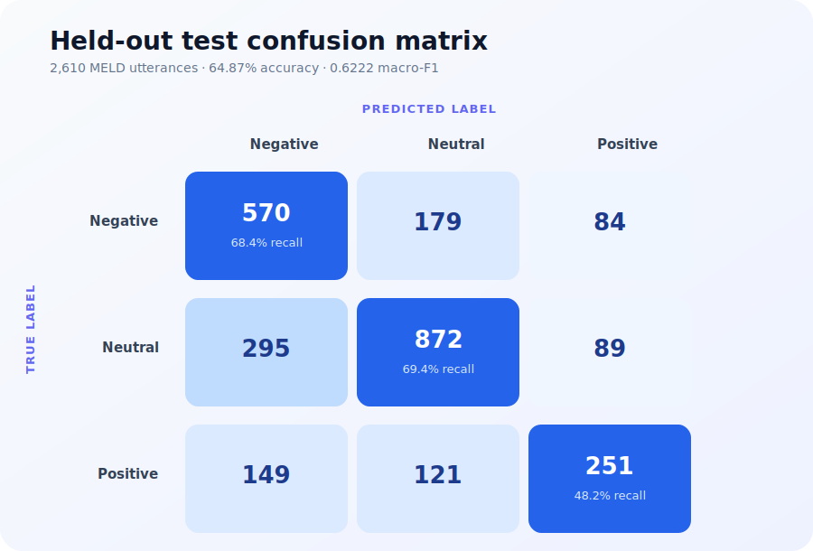
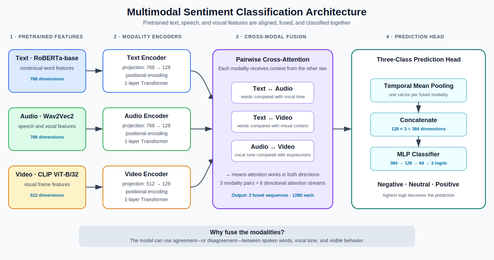

# Multimodal Sentiment Analysis

<p align="center">
  <a href="https://github.com/Dhananjaya12/MultiModalSentiment/actions/workflows/tests.yml"></a>
  
  
  
</p>

A multimodal model that predicts whether a conversation is **negative**, **neutral**, or **positive** using text, audio, and video.

The project uses pretrained feature extractors for each modality and a cross-modal Transformer to combine them. It includes training, evaluation, experiment tracking, checkpoint recovery, automated tests, and a Gradio demo.

## Results

The final model was evaluated on the complete held-out MELD test split.

| Metric | Result |
|---|---:|
| Test samples | 2,610 |
| Accuracy | **64.87%** |
| Macro-F1 | **0.6222** |
| Negative F1 | 0.6172 |
| Neutral F1 | 0.7183 |
| Positive F1 | 0.5312 |

<p align="center">
  
</p>

Neutral sentiment performs best. Positive sentiment is the most difficult class and is the main area for future improvement.

## Architecture

<p align="center">
  
</p>

The model follows four simple steps:

1. **Extract features**
   - RoBERTa represents the spoken words.
   - Wav2Vec2 represents the voice and speech signal.
   - CLIP represents the video frames.

2. **Process each modality**
   - A small Transformer learns patterns over time separately for text, audio, and video.

3. **Share information between modalities**
   - Text, audio, and video are compared with one another.
   - For example, the text may sound positive while the voice or facial expression suggests otherwise.
   - This step produces one improved representation for each modality.

4. **Predict sentiment**
   - The three representations are combined.
   - A classification layer predicts **negative**, **neutral**, or **positive**.

## Training approach

The final training setup uses:

- weighted cross-entropy for class imbalance;
- label smoothing and dropout to reduce overfitting;
- modality dropout to handle missing or weak signals;
- only the final RoBERTa encoder layer unfrozen;
- separate learning rates for the classification head and the remaining model;
- gradient clipping, cosine learning-rate decay, and early stopping;
- model selection based on validation macro-F1.

MLflow records training metrics and artifacts. A complete checkpoint is saved after every epoch, allowing interrupted Kaggle or Colab runs to resume.

## Project structure

```text
app/             Gradio interface
data/            HDF5 data loader and DVC metadata
evaluation/      Test evaluation
inference/       Audio, video, text, and prediction pipeline
model/           Encoders and cross-modal fusion
training/        Training loop and checkpointing
tests/           Automated tests
utils/           Training and evaluation plots
main.py          Complete training pipeline
config.json      Project configuration
```

## Installation

Create and activate a virtual environment, then install the training dependencies:

```bash
pip install -r requirements.txt
```

For the Gradio application and raw video inference:

```bash
pip install -r requirements-inference.txt
```

FFmpeg must also be installed and available on `PATH`.

## Dataset

This project uses the [MELD dataset](https://affective-meld.github.io/).

The processed HDF5 file is expected to contain:

```text
audio
vision
labels
texts
ids
input_ids
attention_mask
```

The fixed dataset split contains:

| Split | Samples |
|---|---:|
| Train | 9,989 |
| Validation | 1,108 |
| Test | 2,610 |

Update the local paths in `config.json` before training.

## Training

Run the complete pipeline:

```bash
python main.py
```

This trains the model, saves the best checkpoint, evaluates the test split, and creates the result plots.

Important outputs:

```text
best_model.pt    Best model selected by validation macro-F1
checkpoint.pt    Model, optimizer, scheduler, and training history
mlruns/          MLflow experiment data
```

## Running the demo

Set the model and config paths, then start the application.

Windows PowerShell:

```powershell
$env:MODEL_PATH="outputs/best_model.pt"
$env:CONFIG_PATH="config.json"
python app/app.py
```

Linux or macOS:

```bash
MODEL_PATH=outputs/best_model.pt CONFIG_PATH=config.json python app/app.py
```

Open `http://localhost:7860`.

The interface supports:

- text-only analysis;
- uploaded video;
- recorded webcam video.

When a video is selected, the text box is disabled and the speech transcript is generated automatically.

## Limitations

- MELD contains scripted television dialogue, so performance may differ on real meetings or interviews.
- Sarcasm and context-dependent dialogue remain difficult.
- Positive sentiment has lower recall than the other classes.
- Softmax confidence is not calibrated.
- Large audio and video sequences make full-dataset evaluation computationally expensive.

## Main technologies

PyTorch · Transformers · RoBERTa · Wav2Vec2 · OpenCLIP · MLflow · DVC · HDF5 · Gradio

## Acknowledgements

- [MELD](https://affective-meld.github.io/)
- [RoBERTa-base](https://huggingface.co/roberta-base)
- [Wav2Vec2-base-960h](https://huggingface.co/facebook/wav2vec2-base-960h)
- [OpenCLIP](https://github.com/mlfoundations/open_clip)

The processed dataset and trained model weights are not stored in this repository because of their size and source licensing.